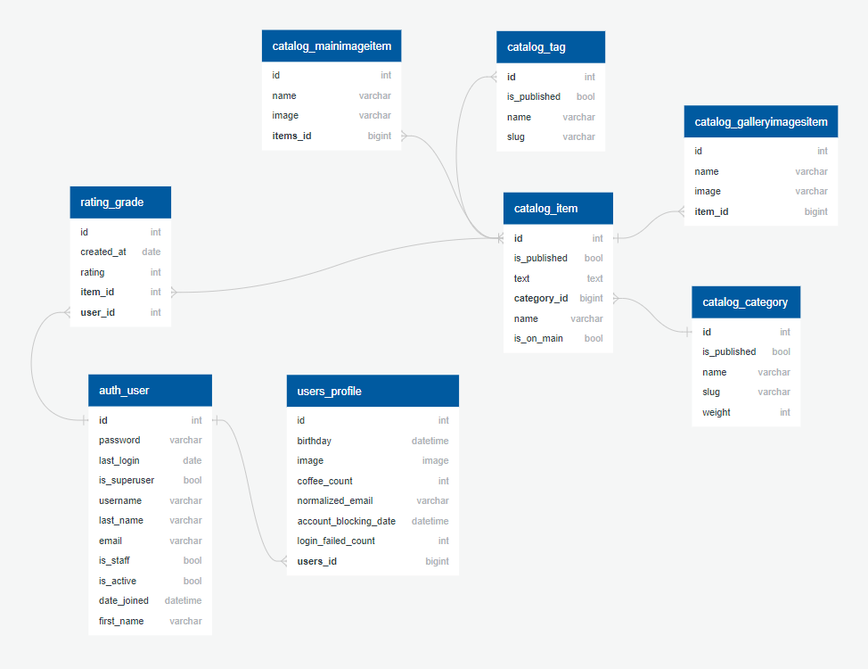
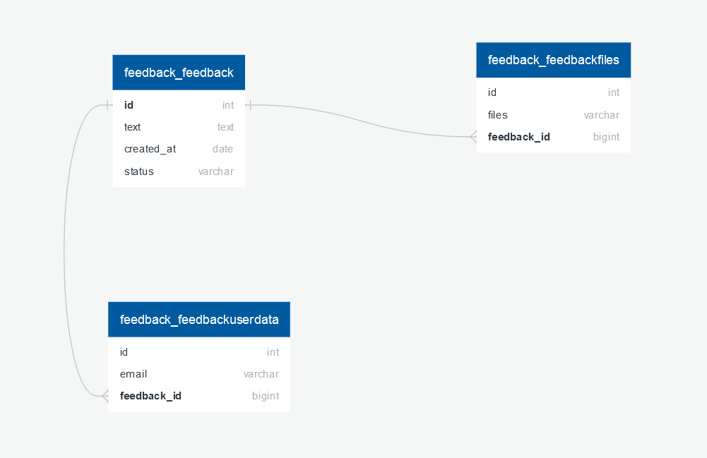

# lyceum

[](https://github.com/mge410/lyceum/actions/workflows/python-package.yml)
[](https://github.com/psf/black)

**Запуск проекта**

Первый шаг одинаковый, дальше разные для OC Windows/Linux  
**1** Клонируем себе репозиторий:  
```git clone https://github.com/mge410/lyceum.git ```  
и переходим в папку с проектом   
```cd lyceum ```  

P.S в тестовой базе уже есть **пользователь администратор**, если вы используйте  
проект для ознакомления - можете воспользоваться им и пропустить 5-й пункт.  
Логин: admin  
Пароль: admin

| Windows:      | Linux:               |
| ------------- |------------------|
| **2** Заводим виртуальное окружение и активируем его: <br> ```python -m venv venv ``` <br> ```.\venv\Scripts\activate ```                                                         | **2** Заводим виртуальное окружение и активируем его: <br> ```python3 -m venv venv ``` <br> ```source venv/bin/activate ```      |
| **3** Обновляем pip и качаем туда все что есть в requirements.txt: <br>```python -m pip install --upgrade pip``` <br> ```pip install -r .\requirements\requirements.txt ```       | **3** Обновляем pip и качаем туда все что есть в requirements.txt: <br> ```pip install -U pip``` или    ```python3 -m pip install --upgrade pip``` <br> ```pip install -r requirements/requirements.txt```    |
| **4** Загружаем миграции для базы данных и наполняем их тестовыми данными <br>```python .\lyceum\manage.py migrate``` <br> ```python .\lyceum\manage.py loaddata data.json ```    | **4** Загружаем миграции для базы данных и наполняем их тестовыми данными <br>```python lyceum/manage.py migrate``` <br> ```python lyceum/manage.py loaddata data.json ```    |
| **5** Cоздаём пользователя администратора для доступа в админку  <br>```python .\lyceum\manage.py createsuperuser```                                                              | **5** Cоздаём пользователя администратора для доступа в админку <br>```python lyceum/manage.py createsuperuser``` <br>   |
| **6** Запускаем проект: <br> ``` python .\lyceum\manage.py runserver ```                                                                                                          | **6** Запускаем проект: <br> ```python3 lyceum/manage.py runserver```           |


**Настройка проекта**  
В репозитории есть пример файла с настройками проекта __example_config.env__
копируем его файл с названием .env внутри проекта в папку lyceum   
__Для Windows__   
```cp example_config.env .\lyceum\.env```   
__Для linux__   
```cp -r example_config.env /lyceum/.env```   
После чего его можно настроить под себя   

---

***Установка зависимостей***  
```cd requirements```  

Основные зависимости:  
```python -m pip install --upgrade pip```   
```pip install -r requirements.txt ```  

Зависимости для разработки  
``` pip install -r requirements_dev.txt```  

Зависимости для тестирования   
``` pip install -r requirements_test.txt```

Схема Базы Данных в проекте  



Схема Базы Данных Обратной связи в проекте  
